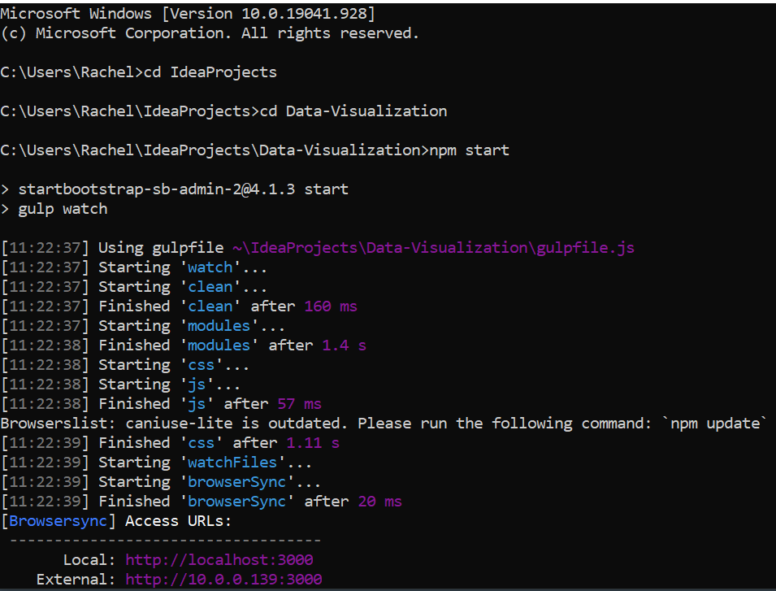

Insight Data Visualization

Purpose: To create a freely-accessible, open source tool capable
to interacting with nuclear spectra & educating about radiation
detection.

Steps to use:

1. Download
    1. intellij or similar IDE
    2. git
    3. npm - npm install - npm start
    4. python
    5. anaconda
    6. pip
    7. python packages: becquerel, mpld3, json, numpy, matplotlib, pandas
    
2. Download all Insight code from GitHub & save it to an
easily accessible file path

3. Open command prompt or terminal

4. Navigate to where you saved Insight code

5. type
        npm start
   
It should look like this: 

Special Thanks: Christian Murray, Ali Hanks, RadWatch/DoseNet

